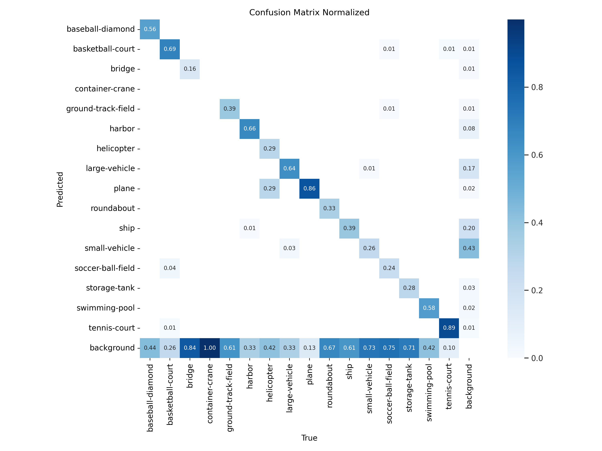
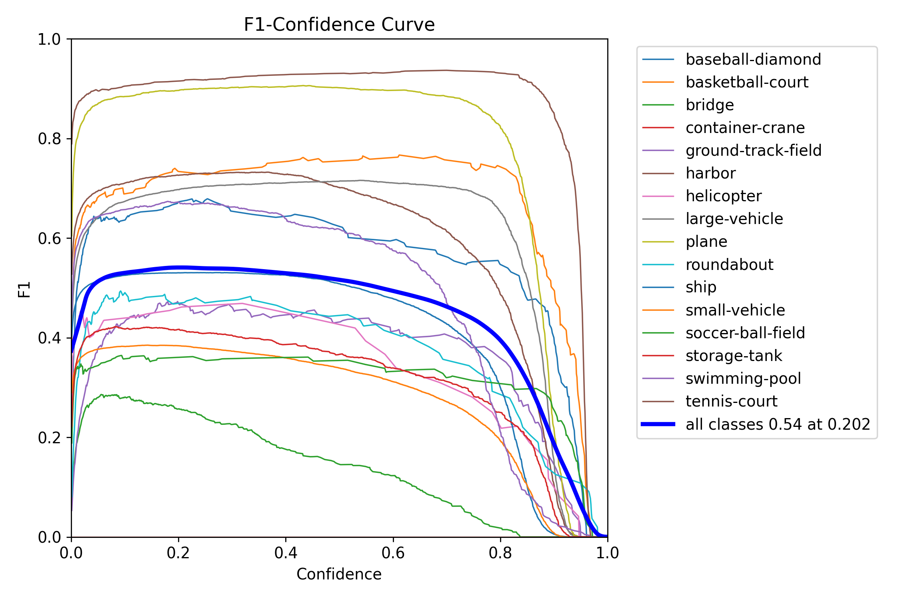
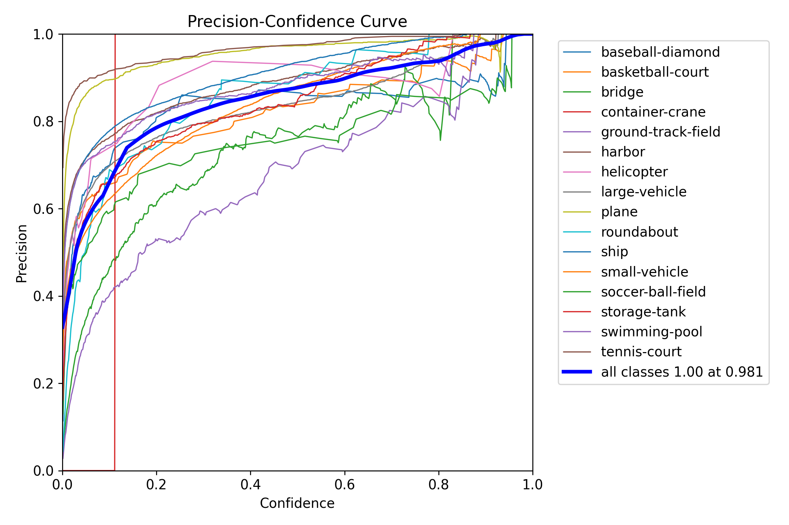
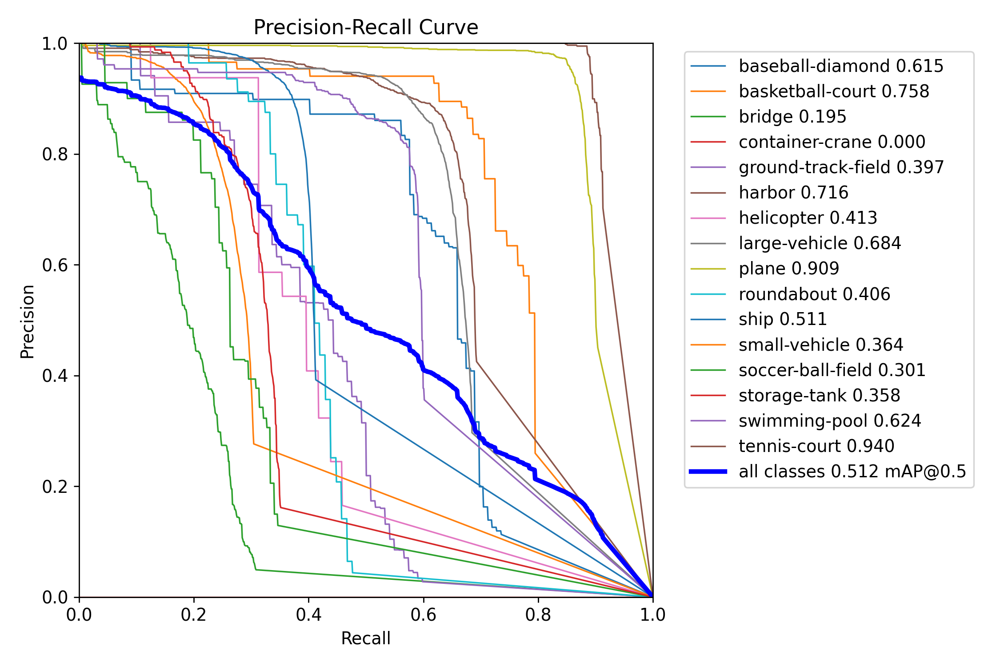
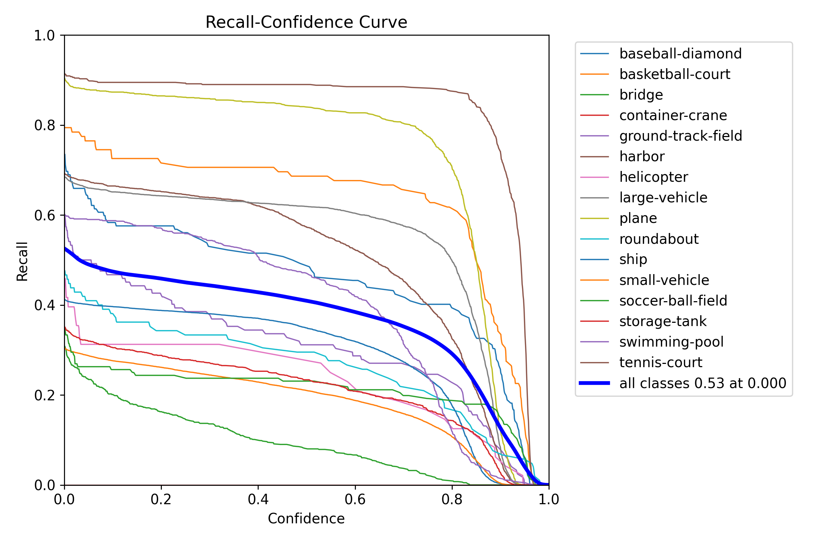
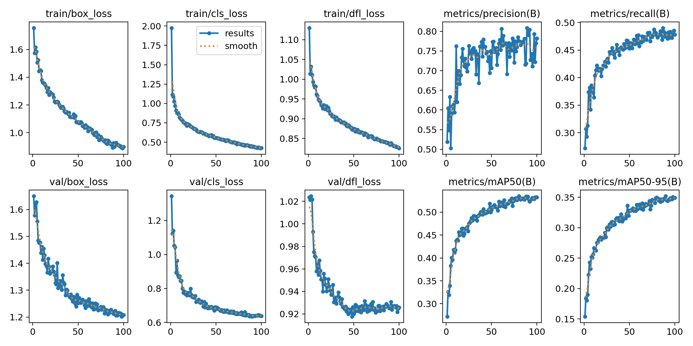
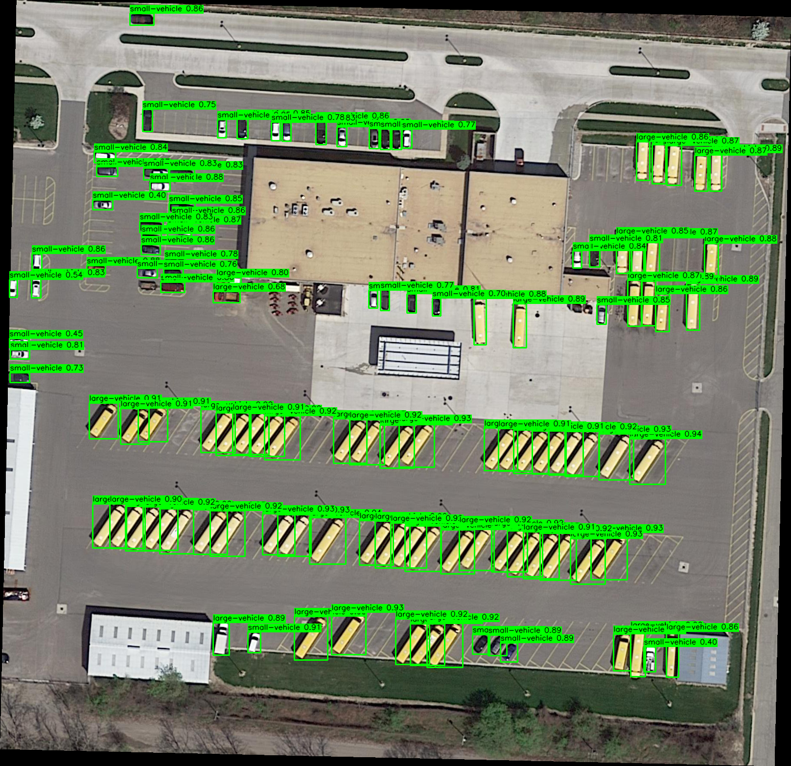
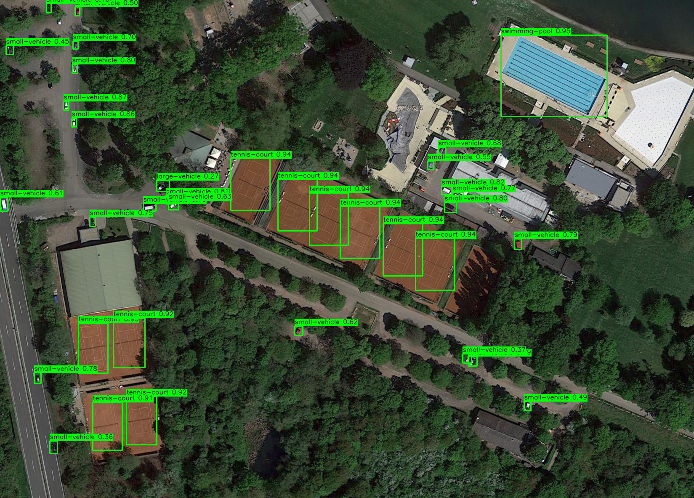
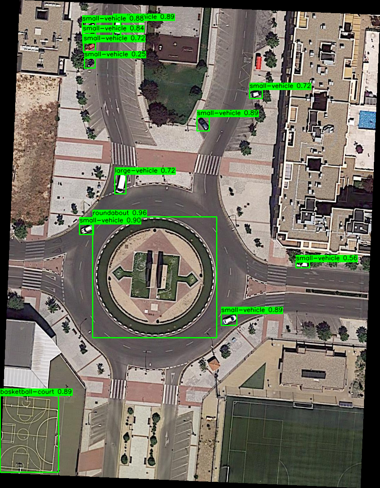

# Aerial-YOLO-DOTA: Advanced Object Detection for Aerial Imagery

This repository showcases state-of-the-art object detection in aerial and satellite imagery using [YOLOv9](https://docs.ultralytics.com/models/yolov9/) on the [DOTA (Dataset for Object Detection in Aerial Images) v1.5](https://captain-whu.github.io/DOTA/dataset.html) dataset.


## Key Features

- Implementation of [YOLOv9](https://docs.ultralytics.com/models/yolov9/) for efficient, accurate detection of small objects in large-scale aerial images
- Custom data pipeline for the [DOTA v1.5](https://captain-whu.github.io/DOTA/dataset.html) dataset, supporting rotated bounding boxes
- Fine-tuned models achieving high performance on aerial object categories
- Interactive demo for real-time object detection on aerial imagery
- Comprehensive evaluation metrics and visualization tools


## Dataset

We have prepared an easy-to-use consolidated [DOTA v1.5](https://captain-whu.github.io/DOTA/dataset.html) dataset, 
including labels suitable for use with [YOLOv9](https://docs.ultralytics.com/models/yolov9/). This dataset is 
available on our [Google Drive](https://drive.google.com/file/d/13fAWtcBEvLfUkQgUkHvcqWxI1HZNOin6/view?usp=sharing).

## Repository Structure

```plaintext
Aerial-YOLO-DOTA/
├── src/
│   ├── 01_convert_dota_to_yolo.py
│   ├── 02_create_train_test_split.py
│   ├── 03_train_yolo_dota_model.py
│   ├── 04_label_test_images.py
│   ├── dota.yaml
│   └── helpers.py
├── results/
│   ├── 100e-16b-0.01lr/
│   ├── 250e-128b-0.028lr/
│   └── 350e-256b-0.0028lr/
├── examples/
└── README.md
```

## Usage

Clone this repository:
```shell
git clone https://github.com/your_username/Aerial-YOLO-DOTA.git
```

Install dependencies:
```shell
pip install -r requirements.txt
```

Download the [DOTA v1.5](https://captain-whu.github.io/DOTA/dataset.html) dataset 
from our [Google Drive](https://drive.google.com/file/d/13fAWtcBEvLfUkQgUkHvcqWxI1HZNOin6/view?usp=sharing) 
and place it in the appropriate directory.

Change directory into `src`:
```shell
cd src
```
Our scripts assume you are running from within the src directory. 
All subsequent commands should be executed from this location.

Convert DOTA labels to YOLO format:

```shell
python 01_convert_dota_to_yolo.py
```
However, this step is not necessary if you're using our pre-processed dataset.

Create train/test split:
```shell
python 02_create_train_test_split.py
```

Train the model:
```shell
python 03_train_yolo_dota_model.py 
```

Label test images:
```shell
python 04_label_test_images.py --model path/to/best.pt
```

## Experiments

We conducted three main experiments with varying hyperparameters and computational resources:

1. **100e-16b-0.01lr**
   - 100 epochs, 16 batch size, 0.01 learning rate
   - Trained on 1x H100 (80 GB PCIe) 26 CPU cores, 205.4 GB RAM, 1.1 TB SSD

2. **250e-128b-0.028lr**
   - 250 epochs, 128 batch size, 0.028 learning rate
   - Trained on 8x H100 (80 GB SXM5) 208 CPU cores, 1.9 TB RAM, 24.2 TB SSD

3. **350e-256b-0.0028**
   - 350 epochs, 256 batch size, 0.0028 learning rate
   - Trained on 8x H100 (80 GB SXM5) 208 CPU cores, 1.9 TB RAM, 24.2 TB SSD

## Experimental Results and Analysis

Our experiments with different batch sizes yielded interesting insights, 
particularly highlighting the effectiveness of smaller batch sizes in this specific task.

### 100e-16b-0.01lr (Best Performing Model)

#### Normalized Confusion Matrix

The normalized confusion matrix for our best performing model shows several interesting patterns:

1. Strong diagonal performance: Many classes show high true positive rates, indicated by darker blue squares along the diagonal. Tennis courts (0.89), planes (0.86), and basketball courts (0.69) are particularly well-classified.

2. Thematically consistent misclassifications: The off-diagonal errors make intuitive sense given the visual and contextual similarities between certain classes:
   - Ships are sometimes confused with harbors (0.20), reflecting their co-occurrence in scenes.
   - Small vehicles are occasionally misclassified as large vehicles (0.17), likely due to scale ambiguities in aerial imagery.
   - Planes and helicopters show some mutual confusion (0.29 for helicopters classified as planes), which is understandable given their shared aerial nature.

3. Sport facility confusion: There's some misclassification between similar sporting facilities, such as soccer ball fields being mistaken for other court types.

4. Background class interactions: The 'background' class shows significant interactions with other classes, particularly bridges (0.84) and container cranes (1.00). This suggests challenges in distinguishing these structures from the background in some scenes.

5. Absence of egregious errors: Notably, there are no severe misclassifications between vastly different object types (e.g., no airplanes mistaken for ships), indicating the model has learned meaningful features for each class.

6. Class-specific challenges: Some classes like 'roundabout' (0.33) and 'small-vehicle' (0.26) show lower true positive rates, suggesting they might benefit from additional training data or feature engineering.

Overall, the confusion matrix reflects a model that has learned to distinguish between classes in a contextually and thematically sensible manner, with errors primarily occurring between visually or functionally similar object categories.



#### F1 Score Curve

The F1 score curve demonstrates the model's performance across varying confidence thresholds, 
revealing crucial insights into its behavior and effectiveness. The overall F1 score 
peaks at 0.54 with a confidence threshold of 0.202, indicating an optimal balance between 
precision and recall. 

However, the curve shows significant variation across object classes, 
with harbor, plane, and basketball court consistently performing well, while classes like soccer 
ball field and bridge struggle. This suggests that class-specific confidence thresholds could be more effective 
than a single global threshold.

1. Class Performance Variation:
   - There's a wide spread in F1 scores across different classes, indicating varying levels of detection accuracy.
   - Some classes like harbor, plane, and basketball-court consistently show high F1 scores across a range of confidence thresholds.
   - Others, like soccer-ball-field and bridge, perform relatively poorly with lower F1 scores.

2. Optimal Confidence Threshold:
   - The overall performance (thick blue line) peaks at a confidence of about 0.2, with an F1 score of 0.54.
   - This suggests that the model's default confidence threshold might be set too high, and lowering it could improve overall performance.

3. Curve Shapes:
   - Most classes show a similar curve shape, peaking early and gradually declining as confidence increases.
   - This indicates that for most classes, increasing the confidence threshold beyond a certain point reduces overall performance.

4. High Confidence Performance:
   - Several classes (e.g., harbor, plane, basketball-court) maintain high F1 scores even at high confidence levels, suggesting robust detection for these classes.
   - Other classes (e.g., soccer-ball-field, bridge) show rapid decline in F1 score as confidence increases, indicating less reliable high-confidence detections.

5. Class-Specific Insights:
   - Harbor and plane classes show exceptionally good performance, maintaining high F1 scores across a wide range of confidence thresholds.
   - Soccer-ball-field consistently underperforms, suggesting difficulties in detecting or distinguishing this class.

6. Confidence Calibration:
   - The diversity in curve shapes suggests that class-specific confidence thresholds might be beneficial, rather than a single threshold for all classes.

7. Model Behavior:
   - The curves generally show smooth transitions, indicating consistent model behavior across confidence levels.
   - The sharp drops at very high confidences (>0.9) are common across most classes, suggesting very few predictions with extremely high confidence.

8. Potential for Improvement:
   - The significant gap between top-performing and low-performing classes suggests room for targeted improvements in training or data augmentation for specific classes.

These insights can guide further model refinement, particularly in adjusting confidence thresholds and focusing on improving performance for lower-scoring classes.



#### Precision Curve

The precision curve indicates a strong positive correlation between confidence and precision across all object classes, with notable variations in performance. Specifically:
The precision curve indicates that as confidence thresholds increase, the model's predictions become increasingly accurate across all classes, culminating in near-perfect precision at very high confidence levels. Key observations include:

1. Overall Trend: All classes show an increasing precision as confidence increases, which is expected behavior. This indicates that higher confidence predictions are generally more accurate across all classes.

2. Perfect Precision: The curve for all classes (thick blue line) reaches a precision of 1.00 at a confidence of 0.981. This means that at very high confidence thresholds, the model's predictions are extremely reliable, albeit likely with lower recall.

3. Class Variation: There's significant variation in precision performance across different classes, especially at lower confidence levels:
   - Harbor and plane classes show high precision even at low confidence thresholds.
   - Ground-track-field and soccer-ball-field have lower precision, especially at lower confidences.

4. Rapid Initial Increase: Most classes show a steep increase in precision at low confidence levels (0-0.2), indicating that even a small increase in confidence threshold can significantly improve precision.

5. Plateau Effect: Several classes (e.g., harbor, plane, tennis-court) reach high precision quickly and plateau, maintaining high precision across a wide range of confidence thresholds.

6. Challenging Classes: Some classes (e.g., ground-track-field, soccer-ball-field) show a more gradual increase in precision, suggesting these are more challenging for the model to predict accurately.

7. Confidence Threshold Implications: The diverse curve shapes suggest that optimal confidence thresholds may vary significantly between classes for precision-focused tasks.

8. High Confidence Convergence: Most classes converge to very high precision at high confidence levels, indicating that the model's highest confidence predictions are generally reliable across all classes.

9. Red Vertical Line: There's a red vertical line at around 0.1 confidence, which might indicate a default or recommended confidence threshold. Many classes show good precision improvement by this point.

10. Stability: Some classes (e.g., harbor, plane) show very stable, smooth curves, while others (e.g., bridge, soccer-ball-field) have more erratic patterns, possibly indicating less consistent performance or smaller sample sizes for these classes.

These insights are valuable for understanding the model's precision characteristics across different object classes and can guide decisions on confidence thresholds for various applications, especially where high precision is critical.



#### Precision-Recall Curve

The precision-recall curve illustrates the trade-off between precision and recall for 
different threshold values across various object classes in our aerial imagery detection 
task. Key takeaways include:

1. Overall Performance: The model achieves a mean Average Precision (mAP) of 0.512 at 0.5 IoU threshold across all classes, indicating moderate overall performance.

2. Class Variation: There's significant variation in performance across different object classes:
   - Tennis courts (0.940) and planes (0.909) show excellent performance with high precision maintained even at high recall.
   - Basketball courts (0.758) and harbors (0.716) also perform well.
   - Classes like bridge (0.195), soccer-ball-field (0.301), and small-vehicle (0.364) struggle, with rapidly decreasing precision as recall increases.

3. Top Performers: Tennis courts, planes, and basketball courts maintain high precision even as recall increases, suggesting robust detection for these classes.

4. Challenging Classes: Bridges, soccer ball fields, and small vehicles show poor performance, with precision dropping quickly even at low recall. This indicates difficulty in reliably detecting these objects.

5. Container Crane Anomaly: The container-crane class shows 0.000 performance, suggesting a potential issue with the dataset or model for this specific class.

6. Trade-off Patterns: Most classes show the expected trade-off between precision and recall, but the curves vary significantly in shape and area under the curve.

7. Recall Range: Some classes (e.g., tennis-court, plane) achieve high recall values, while others (e.g., bridge, soccer-ball-field) struggle to reach high recall even at low precision.

8. Precision at Low Recall: Many classes maintain high precision at low recall values, indicating that the model's highest confidence predictions are generally accurate.

9. Area Under the Curve: Classes with larger areas under their PR curves (e.g., tennis-court, plane, basketball-court) indicate better overall performance across different confidence thresholds.

10. Model Tuning Opportunities: The significant performance variation suggests that class-specific strategies (like focused data augmentation or adjusted loss weightings) could potentially improve results for lower-performing classes.

These insights can guide further model refinement, particularly in addressing the challenges with lower-performing classes and leveraging the strengths demonstrated in well-performing categories.



#### Recall Curve

The recall curve shows how the model's ability to detect objects (recall) changes as we adjust 
the confidence threshold for making predictions. Key takeaways include:

1. Overall Performance: The model achieves an average recall of 0.53 at a confidence threshold of 0.000 across all classes, indicating moderate overall detection capability.

2. Class Variation: There's significant variation in recall performance across different object classes:
   - Tennis courts, planes, and harbors show excellent performance, maintaining high recall even at high confidence thresholds.
   - Soccer ball fields, bridges, and container cranes struggle, with rapidly decreasing recall as confidence increases.

3. Top Performers: Tennis courts, planes, and harbors maintain high recall (above 0.8) even as confidence increases, suggesting robust detection for these classes across a wide range of confidence thresholds.

4. Challenging Classes: Soccer ball fields, bridges, and container cranes show poor performance, with recall dropping quickly even at low confidence thresholds. This indicates difficulty in reliably detecting these objects.

5. Confidence Threshold Impact: Most classes show a gradual decrease in recall as confidence increases, but the rate of decrease varies significantly between classes.

6. High Confidence Detection: Only a few classes (tennis courts, planes, harbors) maintain reasonable recall at very high confidence thresholds, indicating these are the most reliably detected objects.

7. Low Confidence Performance: At low confidence thresholds, there's a wide spread in recall values across classes, ranging from about 0.3 to 0.9, highlighting the varying difficulty in detecting different object types.

8. Curve Shapes: Some classes (e.g., tennis courts, planes) show a more gradual decline in recall, while others (e.g., soccer ball fields, bridges) drop off more sharply, suggesting different sensitivity to confidence thresholds.

9. Potential for Improvement: The significant performance variation suggests that class-specific strategies (like focused data augmentation or adjusted model architectures) could potentially improve results for lower-performing classes.

10. Confidence Threshold Selection: The curve provides insights for selecting appropriate confidence thresholds for different use cases, balancing between higher recall (lower thresholds) and more confident predictions (higher thresholds).

These insights can guide further model refinement, particularly in addressing the challenges with lower-performing classes and leveraging the strengths demonstrated in well-performing categories.



#### Overall Results Summary

The overall results summary provides a comprehensive view of the model's performance, 
highlighting key performance metrics and their implications.

1. Loss Reduction: All three loss components (box_loss, cls_loss, and dfl_loss) show a consistent decrease over the training epochs for both training and validation sets. This indicates the model is learning effectively.

2. Convergence: The losses appear to stabilize towards the end of training, suggesting the model has largely converged after 100 epochs.

3. Validation Performance: The validation losses closely follow the training losses, indicating good generalization without significant overfitting.

4. Precision and Recall: Both precision and recall metrics show steady improvement over time, with recall appearing to improve more dramatically in the early epochs.

5. mAP Performance: The mean Average Precision (mAP) at both 0.5 IoU (mAP50) and 0.5-0.95 IoU (mAP50-95) show consistent improvement throughout training, reaching about 0.52 for mAP50 and 0.35 for mAP50-95 by the end.

6. Learning Dynamics: The rapid initial improvement in most metrics followed by more gradual gains suggests the model quickly learns major features before fine-tuning.

7. Stability: The metrics/precision and metrics/recall plots show some fluctuation, which is normal, but maintain an overall upward trend.

8. Room for Improvement: While the performance is good, the final mAP values suggest there's still room for potential improvement, possibly through longer training or architectural adjustments.

These results indicate a successful training process with good generalization and consistent improvement across multiple metrics, providing a solid foundation for object detection in aerial imagery.



### Loss Analysis

Our best performing model with a batch size of 16 showed interesting dynamics between 
different loss components near the optimal validation values. At epochs 98 and 100, we observed:

```text
epoch  val/box_loss,  val/cls_loss,  val/dfl_loss
98     1.2021         0.64126        0.92176
100    1.2086         0.6379         0.92579
```
These values indicate subtle trade-offs between:

* **Box_loss**: Focusing on accurate positioning and sizing of bounding boxes.
* **Cls_loss (Class loss)**: Ensuring correct classification of detected objects.
* **Dfl_loss (Distribution Focal Loss)**: Refining predictions for similar or hard-to-distinguish objects.

The slight variations in these losses between epochs 98 and 100 suggest that the model is 
fine-tuning its balance between accurate localization, classification, and handling of difficult cases.

### Key Findings

1. **Batch Size Impact**: Surprisingly, our smallest batch size of 16 produced the best results. 
This suggests that for this particular task and dataset, smaller batch sizes allow for more frequent 
model updates and potentially better generalization.

2. **Loss Dynamics**: The interplay between box_loss, cls_loss, and dfl_loss near the optimal 
validation values provides insights into the model's learning process. The model appears to be 
making fine adjustments to balance these different aspects of object detection.

### Future Directions

Based on these results, our future experiments will focus on:

1. Investigating [YOLOv10](https://docs.ultralytics.com/models/yolov10/): We plan to explore the 
capabilities of [YOLOv10](https://docs.ultralytics.com/models/yolov10/) for real-time end-to-end object detection, 
as described in [YOLOv10](https://docs.ultralytics.com/models/yolov10/) documentation.

2. Smaller Batch Sizes and Extended Training: Given the success of batch size 16, 
we will experiment with even smaller batch sizes while increasing the number of epochs to potentially improve performance further.

3. [DOTA v2.0](https://captain-whu.github.io/DOTA/dataset.html) Dataset: To enhance the robustness and applicability of 
our model, we plan to train and evaluate on the [DOTA v2.0](https://captain-whu.github.io/DOTA/dataset.html) dataset, 
which offers [brief description of DOTA v2.0 advantages].

These future directions aim to push the boundaries of our current achievements and further improve the accuracy and 
efficiency of aerial image object detection.

## Example Annotations

We've included a gallery of annotations from the test dataset using our best-performing model. These images 
demonstrate the model's ability to detect and classify objects in real-world aerial imagery scenarios.


This aerial image demonstrates several key strengths of your object detection model:

1. Small Vehicle Detection: The model successfully identifies numerous small vehicles on the roads with high confidence (mostly above 0.8).

2. Large Vehicle Detection: It correctly identifies larger vehicles, likely trucks or buses, with distinct bounding boxes.

3. Roundabout Recognition: Two roundabouts are accurately detected and labeled, showcasing the model's ability to identify larger road structures.

4. Handling Complex Scenes: The model performs well in a complex environment with multiple road types (highways, on-ramps, local roads) and intersections.

5. Scale Variation: It handles objects at different scales, from small cars to large roundabouts.

6. Confidence Scoring: The confidence scores provide insight into the model's certainty of its detections.

Additional use cases highlight the versatility of our model across various domains:

Commercial environments (trucks in delivery facilities):



Aviation (aircraft detection):


Suburban settings (pools, vehicles)


Rural areas (tennis courts, pools)



Urban environment (small vehicles, roundabouts and basketball courts)



This range of applications demonstrates our model's potential value for diverse industries including 
logistics, urban planning, real estate, transportation, and environmental monitoring. The ability 
to accurately detect and classify such a wide array of objects in aerial imagery could support tasks like 
traffic analysis, urban development planning, asset management, and even disaster response.

## Conclusion

This project demonstrates the effectiveness of [YOLOv9](https://docs.ultralytics.com/models/yolov9/) in detecting objects in aerial imagery using the [DOTA v1.5](https://captain-whu.github.io/DOTA/dataset.html) dataset. Our experiments show (insert brief conclusion about model performance and insights gained).

The codebase provided here offers a complete pipeline for training, evaluating, 
and using [YOLOv9](https://docs.ultralytics.com/models/yolov9/) models on aerial imagery 
datasets, and can serve as a strong foundation for further research or practical 
applications in this domain.

## Acknowledgements

We thank the creators of the [DOTA](https://captain-whu.github.io/DOTA/) dataset and the 
developers of [YOLOv9](https://docs.ultralytics.com/models/yolov9/) for their invaluable 
contributions to the field of object detection in aerial imagery.

## License

This project is licensed under the MIT License - see the [LICENSE](LICENSE) file for details.
